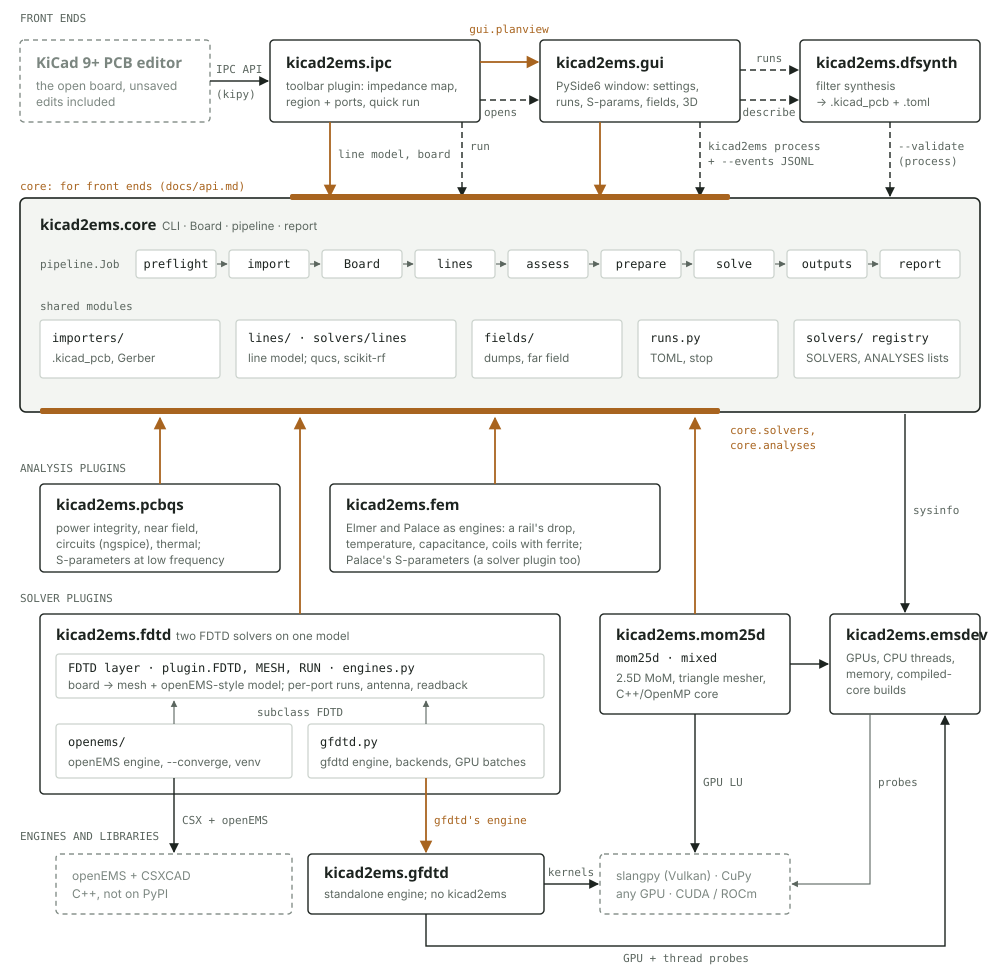

# Architecture

[← Transmission-line model](transmission-lines.md) · [Index](index.md) · [Next: APIs →](api.md)



The parts are the subpackages of the one package, `kicad2ems`: the front ends (`ipc`, the KiCad plugin; `gui`;
`dfsynth`) drive `core`; the analyses (`pcbqs`, `fem`) and the solvers (`fdtd`, `mom25d`, `fem`) plug into it
through `core.analyses` and `core.solvers` ([APIs](api.md)); `fdtd` runs one FDTD model on openEMS or `gfdtd`, and
`emsdev` probes the machine for the rest.

## The run pipeline

`cli.main` reads the command line and the config into one `config.Settings`.
`pipeline.Job` then runs the stages in order. Everything solver-specific goes
through the solver's class.


```mermaid
flowchart LR
    P["preflight<br/>can the solvers run?"] --> A[".kicad_pcb / Gerber<br/>/ board.json"]
    A --> B["importers/"]
    B --> C["Board<br/>&rarr; &lt;name&gt;_board.json"]
    C --> L["lines<br/>the line model"]
    L --> S["assess<br/>can each solver model it?"]
    S --> E["prepare<br/>(FDTD: mesh)"]
    E --> F["solve"]
    F --> G["outputs<br/>.sNp, plots, comparisons"]
    G --> R["report<br/>_run.json, _report.html"]
```

| Stage | What it does |
|---|---|
| preflight | resolves which solvers run and checks each can. A named solver that can't stops the run (exit 2); a reference is dropped with a warning |
| model | builds the `Board` and writes `<name>_board.json` |
| lines | builds the line model, `<name>_tlines.png` and `<name>_lines.json` (its sections, for the GUI) |
| assess | asks each solver whether it can model this board (mom25d can't model gap ports) |
| prepare | each solver builds its own form of the board (FDTD: the mesh). With `--preview`, it stops here |
| solve | runs each solver, cheapest first. A failure is a warning (exit 1 for a named solver) |
| outputs | writes each solver's Touchstone file, the comparison plot, and each solver's extra outputs |
| report | writes `<name>_run.json` and `<name>_report.html` |

Each stage adds its results to `Job.summary`, a JSON-friendly dict ([keys](postprocessing.md#json-summary)). The
report is rendered from that dict alone, so it can be rebuilt from the JSON file. All messages go through `Job.log`,
which prints them, keeps them for the report and sends them to `--events`; lines containing `WARNING` go into the
report's warning list. Lower-level functions take a `log` callable, so they can be used without a `Job`. Plots are
matplotlib `Figure` objects without pyplot, so the GUI can embed them.

<a id="solvers"></a>
## Solvers

A solver is a subclass of `solvers.Solver`, and `solvers.SOLVERS` lists every
one by its module and class (imported on the first `registry()` call): the line
solvers in `core/solvers/lines/`; openEMS's and gfdtd's in
[kicad2ems.fdtd](fdtd/README.md), on the FDTD layer they share; mom25d's in
`kicad2ems.mom25d.solvers`; Palace's in `kicad2ems.fem`; pcbqs's in
`kicad2ems.pcbqs.analyses`. [APIs](api.md#solvers) lists what a solver declares
and implements.

A solver, or a program that drives kicad2ems (the GUI, the KiCad plugin,
dfsynth), imports from the core's modules the names in each one's `__all__`
([APIs](api.md) lists them); the rest of kicad2ems.core is the core's own. A
listed solver then appears in `--solvers`, `--check`, the config
(`[solver.mysolver]`), the GUI (a section per option group), the Filter page and
the KiCad plugin's menu. One whose program or package is missing says what to
install in its `check()`. The names, aliases and settings of the listed solvers
are each one's own: `tests/core/test_registry_lists.py` holds them to that.

In kicad2ems.fdtd, `solver.FDTD` builds the mesh and the model, runs the
excitations and writes the dumps and antenna results; `openems` and `gfdtd`
subclass it, each naming its engine (`'<name>'` or `'<name>:<option>'` of
`engines.ENGINES`, whose `api(option)` returns its `ContinuousStructure` and
`openEMS` classes) and listing the shared settings (`MESH + RUN`) before its
own. Solvers share a setting by listing the same `Option` object; no two define
one of the same name.

**Parity.** A solver may approximate the board, but it must say so. `parity.check` compares the board with each
solver's readback and lists any difference the solver didn't declare. The parity tests (kicad2ems-fdtd's
`test_parity.py`, mom25d's `test_kicad2ems_parity.py`) require none on the examples. The declarations also make the
report's *What each solver saw* table.

**Settings as data.** Every setting is declared once, as an `options.Option`:
the run's own in `config.CORE`, each solver's in its class, each analysis's
from its `options()` (a pcbqs tool's table, `options.table`; a fem tool's
parser, `options.from_parser`). The settings class, the command-line options,
the config reader, an analysis's command line (`options.argv`) and the GUI's
forms (`gui/optionrow.py`, one field builder for both) are all built from these
declarations.

<a id="choosing-solvers"></a>
## Choosing solvers (`auto`)

`Job.choose()` replaces `auto` once the board and line model exist: it drops the solvers that can't run or can't
model the board, asks the rest for their `estimate` (FDTD: mesh cells × timesteps × runs, the timesteps from the
pulse length and the line model's longest delay; mom25d: its unknowns' matrix work on the CPU or GPU and the via
count), drops any that needs more than 80 % of the RAM, runs the fastest with the line model, and logs why
([`auto`](usage.md#auto)).

## Module map

```
src/kicad2ems/
  cli.py          the command line
  config.py       the run's options, Settings, config files
  options.py      Option, value converters, tools' options and argv
  pipeline.py     Job: the stages above
  events.py       --events
  starter.py      --init: a commented starter config with the ports found
  stop.py         stopping a run from outside it (the GUI's Stop): a STOP file in its folder
  api/            the core's API: solver (for the solvers), analysis (for the
                  analyses), frontend (for the GUI, the KiCad plugin, dfsynth)
  sysinfo.py      what this machine can run (the GUI's Solvers window; python -m kicad2ems.core.sysinfo)
  sitecfg.py      where the external programs are: site.toml
  importers/      KiCad (kicad/) and Gerber readers
  board.py        Board: the converted board, board.json
  region.py       cropping, nets = auto, extra and cut ports
  parts.py        lumped R/L/C parts
  units.py        part values with SI prefixes ('4k7'); with constants, touchstone and fields/dumps, what pcbqs may
                  import from the core (leaves: they import nothing from kicad2ems)
  edges.py        edge walls
  shapes.py       drawn shapes (the Draw page): copper and cuts onto the board, solids kept as board.solids
  solids.py       the drawn solids as disjoint pieces for the FDTD and Palace; a metal enclosure round the board
  geometry.py     coordinate and polygon helpers
  parity.py       a solver's readback against the board, less what it declared
  fields/         field results of any solver: dump specs and readers, frames and animations, far-field analysis
  phased.py       phased drives: grids, steering, tapers, combining the ports' far fields
  solvers/        the Solver base class and registry
    lines/          the line solvers: the line model as a circuit (qucsator, scikit-rf)
  lines/          the transmission-line model: formulas (closed-form Z0), reference (reference copper, cuts),
                  xsection (the 2D field solver), builder (board -> sections), strips (shapes as strips),
                  topology (paths, coupled lines, discontinuities), coupled (coupled-line formulas), elements (the
                  model's data), sections (one section's field); tlines re-exports them
  sparams.py      reciprocity and mixed-mode conversion
  touchstone.py   .sNp files
  formats.py      the files' format names and versions
  plots.py        figures
  report.py       the HTML report
  overlay.py      the line model over the board (<name>_lines.json): colours by Z0, picking a section
  meshes.py       each solver's mesh as a file, for the 3D view
  runs.py         a run started by another program (the GUI, the KiCad plugin): TOML, command line, events, stop
```

The window is [kicad2ems.gui](gui/README.md) (the `gui` extra brings its
packages): its form is made from the option tables and the solver registry, and
it starts each run as a `kicad2ems` process (`runs.py`), so it needs nothing of
a solver's.

openEMS, CSXCAD, scikit-rf, gmsh, slangpy and the other optional packages
are imported **inside the functions that need them**. A solver or an analysis
imports nothing heavy at module level, because the registry loads every one to
build the settings; the tests rely on it (`test_registry_lists.py` loads the
registries with each optional package missing), and so do runs without openEMS.

**One board for every solver.** No solver reads KiCad files. Each gets the
`Board`, and mom25d reads `<name>_board.json` itself. Changes a solver makes,
such as the FDTD mesh snapping vias to its lines, stay in its class.

## Main data structures

- **`Settings`**: one typed field per option.
- **`KiCadBoard`** (KiCad coordinates, y down): the stackup, copper items, tracks, vias, footprints and
  outline as read.
- **`Board`** (model coordinates, y up, mm): dielectric layers, copper heights and polygons per layer,
  outline, vias `(x, y, r, z0, z1)`, ports, parts, edge walls. `to_dict()` is board.json.
- **`LineModel`**: sections, port nodes, paths, coupled groups and discontinuities.
- **`Result`**: a solver's S-matrix (NaN for ports not driven), port names and reference impedances.

## Processes and threads

- A run is one process. `--jobs N` starts N worker processes, one per driven port.
- openEMS uses its own threads (`--threads`); gfdtd runs its excitations side by side on the GPU.
- A monitor thread follows the FDTD runs' log files for the progress line and `--events`.
- The GUI runs kicad2ems as a separate process, in the output folder, and reads its `--events` file.

---
[← Transmission-line model](transmission-lines.md) · [Index](index.md) · [Next: APIs →](api.md)
